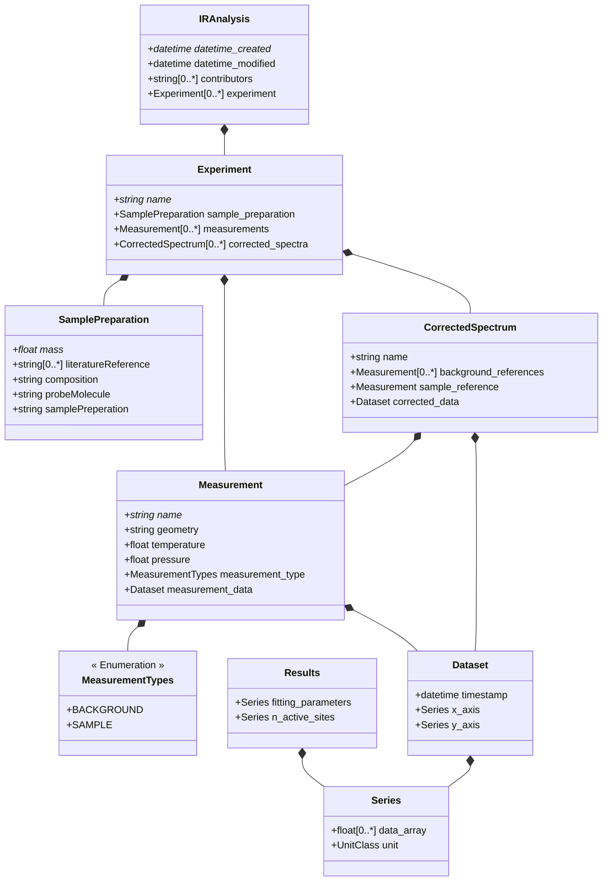

```mermaid
classDiagram
    IRAnalysis *-- Experiment
    Experiment *-- SamplePreparation
    Experiment *-- Measurement
    Experiment *-- CorrectedSpectrum
    Measurement *-- MeasurementTypes
    Measurement *-- Dataset
    CorrectedSpectrum *-- Measurement
    CorrectedSpectrum *-- Dataset
    Results *-- Series
    Dataset *-- Series
    
    class IRAnalysis {
        +datetime datetime_created*
        +datetime datetime_modified
        +string[0..*] contributors
        +Experiment[0..*] experiment
    }
    
    class Experiment {
        +string name*
        +SamplePreparation sample_preparation
        +Measurement[0..*] measurements
        +CorrectedSpectrum[0..*] corrected_spectra
    }
    
    class SamplePreparation {
        +float mass*
        +string[0..*] literatureReference
        +string composition
        +string probeMolecule
        +string samplePreperation
    }
    
    class Measurement {
        +string name*
        +string geometry
        +float temperature
        +float pressure
        +MeasurementTypes measurement_type
        +Dataset measurement_data
    }
    
    class CorrectedSpectrum {
        +string name
        +Measurement[0..*] background_references
        +Measurement sample_reference
        +Dataset corrected_data
    }
    
    class Results {
        +Series fitting_parameters
        +Series n_active_sites
    }
    
    class Dataset {
        +datetime timestamp
        +Series x_axis
        +Series y_axis
    }
    
    class Series {
        +float[0..*] data_array
        +UnitClass unit
    }
    
    class MeasurementTypes {
        << Enumeration >>
        +BACKGROUND
        +SAMPLE
    }
    
```