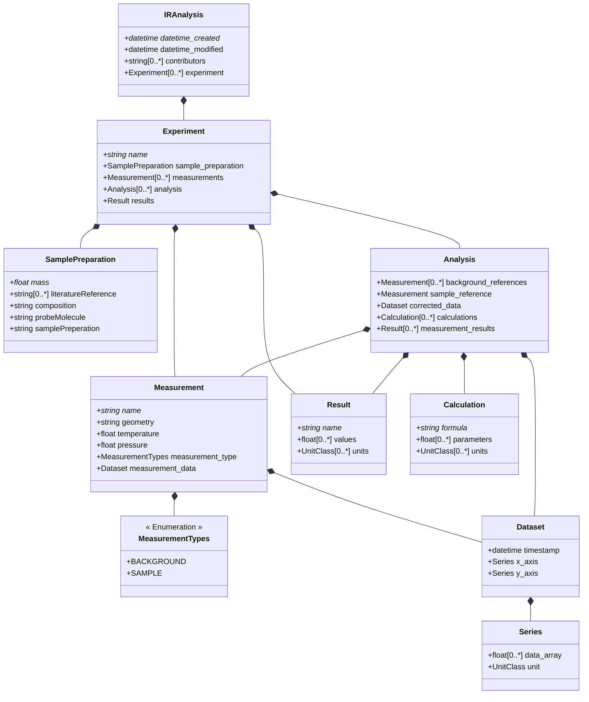

```mermaid
classDiagram
    IRAnalysis *-- Experiment
    Experiment *-- SamplePreparation
    Experiment *-- Measurement
    Experiment *-- Analysis
    Experiment *-- Result
    Measurement *-- MeasurementTypes
    Measurement *-- Dataset
    Analysis *-- Measurement
    Analysis *-- Calculation
    Analysis *-- Result
    Analysis *-- Dataset
    Dataset *-- Series
    
    class IRAnalysis {
        +datetime datetime_created*
        +datetime datetime_modified
        +string[0..*] contributors
        +Experiment[0..*] experiment
    }
    
    class Experiment {
        +string name*
        +SamplePreparation sample_preparation
        +Measurement[0..*] measurements
        +Analysis[0..*] analysis
        +Result results
    }
    
    class SamplePreparation {
        +float mass*
        +string[0..*] literatureReference
        +string composition
        +string probeMolecule
        +string samplePreperation
    }
    
    class Measurement {
        +string name*
        +string geometry
        +float temperature
        +float pressure
        +MeasurementTypes measurement_type
        +Dataset measurement_data
    }
    
    class Analysis {
        +Measurement[0..*] background_references
        +Measurement sample_reference
        +Dataset corrected_data
        +Calculation[0..*] calculations
        +Result[0..*] measurement_results
    }
    
    class Calculation {
        +string formula*
        +float[0..*] parameters
        +UnitClass[0..*] units
    }
    
    class Result {
        +string name*
        +float[0..*] values
        +UnitClass[0..*] units
    }
    
    class Dataset {
        +datetime timestamp
        +Series x_axis
        +Series y_axis
    }
    
    class Series {
        +float[0..*] data_array
        +UnitClass unit
    }
    
    class MeasurementTypes {
        << Enumeration >>
        +BACKGROUND
        +SAMPLE
    }
    
```