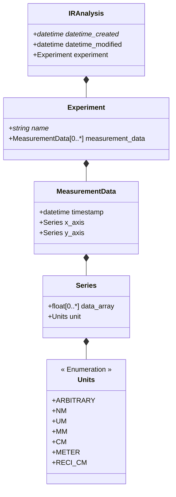

```mermaid
classDiagram
    IRAnalysis *-- Experiment
    Experiment *-- MeasurementData
    MeasurementData *-- Series
    Series *-- Units
    
    class IRAnalysis {
        +datetime datetime_created*
        +datetime datetime_modified
        +Experiment experiment
    }
    
    class Experiment {
        +string name*
        +MeasurementData[0..*] measurement_data
    }
    
    class MeasurementData {
        +datetime timestamp
        +Series x_axis
        +Series y_axis
    }
    
    class Series {
        +float[0..*] data_array
        +Units unit
    }
    
    class Units {
        << Enumeration >>
        +ARBITRARY
        +NM
        +UM
        +MM
        +CM
        +METER
        +RECI_CM
    }
    
```