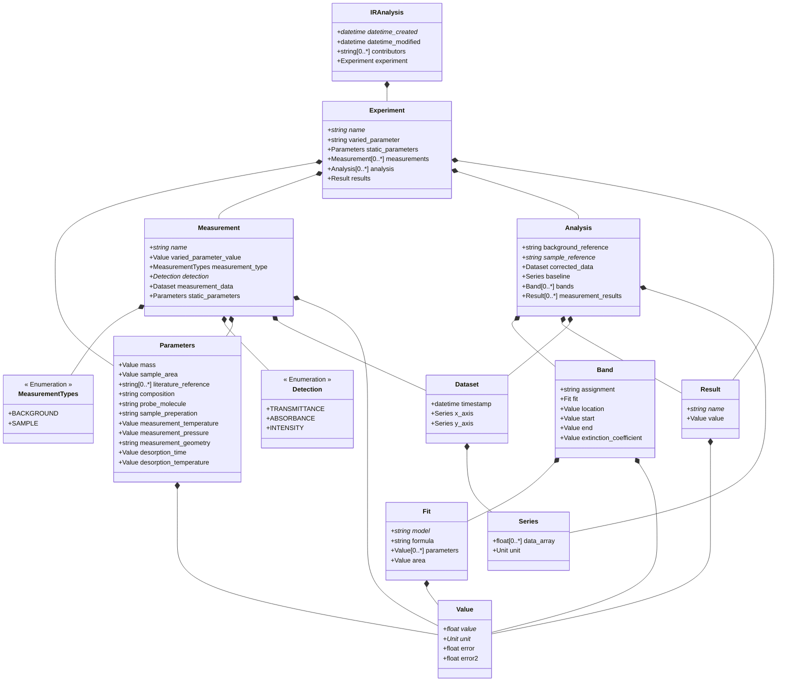

```mermaid
classDiagram
    IRAnalysis *-- Experiment
    Experiment *-- Parameters
    Experiment *-- Measurement
    Experiment *-- Analysis
    Experiment *-- Result
    Parameters *-- Value
    Measurement *-- MeasurementTypes
    Measurement *-- Detection
    Measurement *-- Parameters
    Measurement *-- Dataset
    Measurement *-- Value
    Analysis *-- Band
    Analysis *-- Result
    Analysis *-- Dataset
    Analysis *-- Series
    Band *-- Fit
    Band *-- Value
    Fit *-- Value
    Result *-- Value
    Dataset *-- Series
    
    class IRAnalysis {
        +datetime datetime_created*
        +datetime datetime_modified
        +string[0..*] contributors
        +Experiment experiment
    }
    
    class Experiment {
        +string name*
        +string varied_parameter
        +Parameters static_parameters
        +Measurement[0..*] measurements
        +Analysis[0..*] analysis
        +Result results
    }
    
    class Parameters {
        +Value mass
        +Value sample_area
        +string[0..*] literature_reference
        +string composition
        +string probe_molecule
        +string sample_preperation
        +Value measurement_temperature
        +Value measurement_pressure
        +string measurement_geometry
        +Value desorption_time
        +Value desorption_temperature
    }
    
    class Measurement {
        +string name*
        +Value varied_parameter_value
        +MeasurementTypes measurement_type
        +Detection detection*
        +Dataset measurement_data
        +Parameters static_parameters
    }
    
    class Analysis {
        +string background_reference
        +string sample_reference*
        +Dataset corrected_data
        +Series baseline
        +Band[0..*] bands
        +Result[0..*] measurement_results
    }
    
    class Band {
        +string assignment
        +Fit fit
        +Value location
        +Value start
        +Value end
        +Value extinction_coefficient
    }
    
    class Fit {
        +string model*
        +string formula
        +Value[0..*] parameters
        +Value area
    }
    
    class Result {
        +string name*
        +Value value
    }
    
    class Dataset {
        +datetime timestamp
        +Series x_axis
        +Series y_axis
    }
    
    class Series {
        +float[0..*] data_array
        +Unit unit
    }
    
    class Value {
        +float value*
        +Unit unit*
        +float error
        +float error2
    }
    
    class MeasurementTypes {
        << Enumeration >>
        +BACKGROUND
        +SAMPLE
    }
    
    class Detection {
        << Enumeration >>
        +TRANSMITTANCE
        +ABSORBANCE
        +INTENSITY
    }
    
```